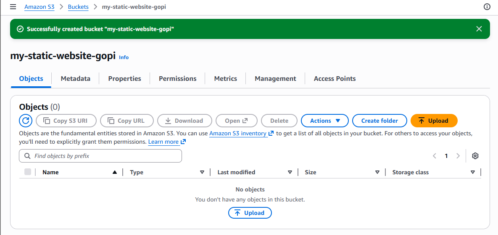
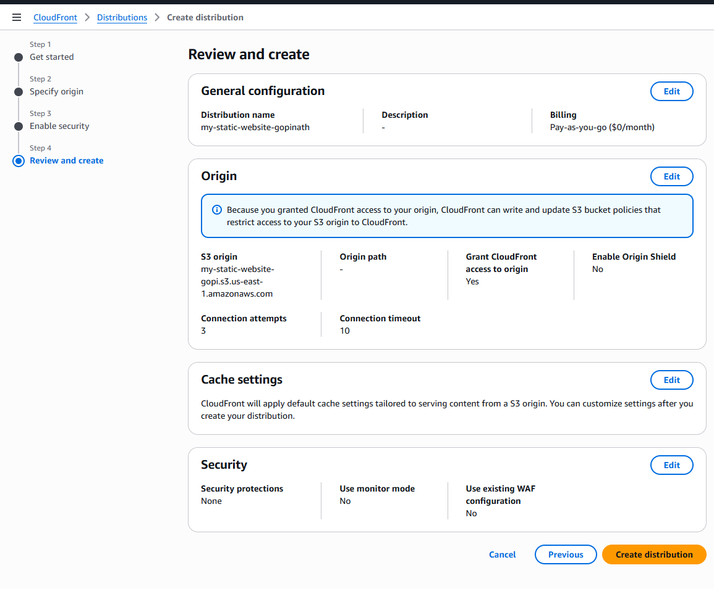
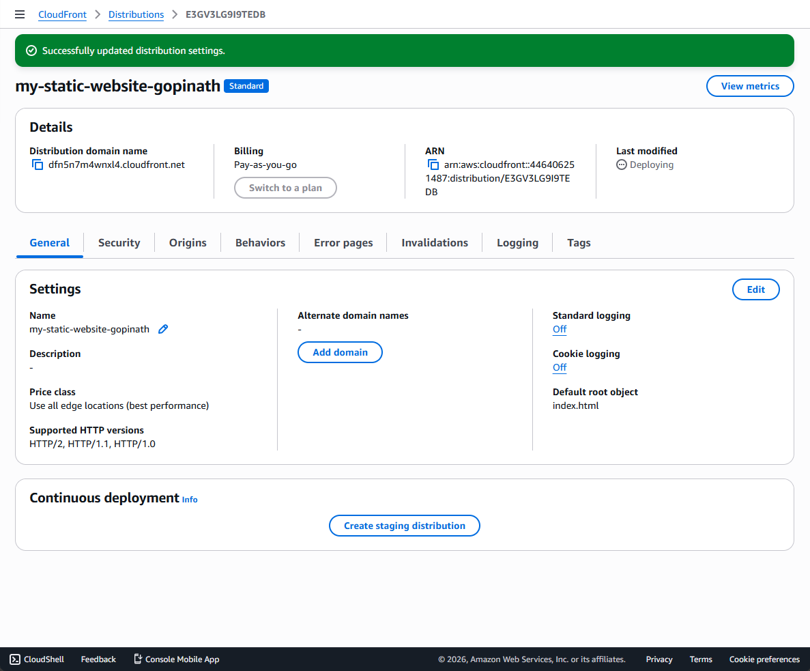
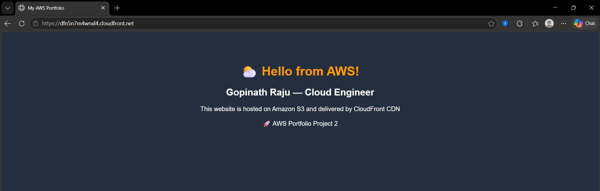

# AWS S3 + CloudFront Static Website Hosting

## Project Overview

Designed and deployed a secure, globally distributed static website on AWS using Amazon S3 for storage and CloudFront as a Content Delivery Network (CDN). This project demonstrates core AWS skills including S3 bucket configuration, Origin Access Control (OAC) security, CloudFront distribution setup, HTTPS enforcement, and cache invalidation — all built from scratch using the AWS Management Console.

**🌐 Live Website:** [https://dfn5n7m4wnxl4.cloudfront.net](https://dfn5n7m4wnxl4.cloudfront.net)

***

## Architecture Diagram

```
User (Browser)
      │
      │ HTTPS Request
      ▼
┌─────────────────────────────┐
│   Amazon CloudFront (CDN)   │
│   dfn5n7m4wnxl4.cloudfront  │
│   - Global Edge Locations   │
│   - Auto HTTPS/SSL Cert     │
│   - Cache + Fast Delivery   │
└─────────────────────────────┘
      │
      │ OAC (Private Access Only)
      ▼
┌─────────────────────────────┐
│     Amazon S3 Bucket        │
│   my-static-website-gopi    │
│   - Block all public access │
│   - index.html stored here  │
└─────────────────────────────┘
```

***

## AWS Services Used

| Service | Purpose |
|---------|---------|
| **Amazon S3** | Store and host static website files (HTML, CSS, JS) |
| **Amazon CloudFront** | Global CDN — fast delivery via 400+ edge locations worldwide |
| **Origin Access Control (OAC)** | Secure S3 bucket — only CloudFront can access it |
| **AWS Certificate Manager** | Auto-provisioned free HTTPS/SSL certificate |

***

## What I Built

1. Created a private Amazon S3 bucket with all public access blocked
2. Uploaded `index.html` static website file to the S3 bucket
3. Created a CloudFront distribution with Origin Access Control (OAC)
4. Configured CloudFront to auto-redirect HTTP → HTTPS
5. Set `index.html` as the default root object
6. CloudFront automatically updated the S3 bucket policy to allow only CloudFront access
7. Verified the live website loads over HTTPS from the CloudFront URL
8. Performed cache invalidation using `/*` to refresh CloudFront edge caches

***

### 1. S3 Bucket Created


### 2. CloudFront Distribution — Review Page


### 3. CloudFront Distribution Created


### 4. Distribution Status — Enabled


### 5. index.html Uploaded to S3


### 6. Live Website on CloudFront URL



***

## Key Concepts Demonstrated

- **Origin Access Control (OAC)** — Modern AWS security best practice that restricts S3 bucket access exclusively to the CloudFront distribution, preventing direct public S3 URL access
- **CDN (Content Delivery Network)** — CloudFront caches content at 400+ global edge locations, reducing latency for users worldwide
- **HTTPS Enforcement** — CloudFront automatically provisions an SSL/TLS certificate and redirects all HTTP requests to HTTPS
- **Cache Invalidation** — Used `/*` invalidation path to purge all cached content at CloudFront edge locations after updating website files
- **S3 Bucket Policy** — Auto-generated by CloudFront OAC to allow only authenticated CloudFront requests to the private bucket

***

## Security Architecture

| Security Feature | Implementation |
|------------------|---------------|
| S3 Public Access | ❌ Fully blocked |
| S3 Bucket Policy | ✅ CloudFront OAC only |
| Data in Transit | ✅ HTTPS/TLS enforced |
| WAF | Not enabled (out of scope) |
| Origin Shield | Not enabled (cost optimization) |

***

## Cost Analysis

| Service | Free Tier | Usage | Cost |
|---------|-----------|-------|------|
| S3 Storage | 5 GB free | ~509 B | ₹0 |
| S3 Requests | 20,000 free | Minimal | ₹0 |
| CloudFront Data Transfer | 1 TB/month always free | Minimal | ₹0 |
| CloudFront Requests | 10M/month always free | Minimal | ₹0 |
| **Total** | | | **₹0** |

***

## What I Learned

- How to configure S3 for secure static website hosting with private access
- How CloudFront CDN improves performance through edge caching
- How OAC (Origin Access Control) secures S3 origins — the modern replacement for OAI
- How HTTPS is auto-provisioned and enforced through CloudFront
- How to perform cache invalidation after content updates
- The difference between S3 website hosting URL vs CloudFront distribution URL

***

## Project Details

- **AWS Region:** US East (N. Virginia) us-east-1
- **CloudFront Distribution ID:** E3GV3LG9I9TEDB
- **Live URL:** https://dfn5n7m4wnxl4.cloudfront.net
- **Completed:** April 2026

***

## Author

**Gopinath Raju** — AWS Cloud Engineer (Transitioning)
- GitHub: [github.com/Gopinath-Raju](https://github.com/Gopinath-Raju)
